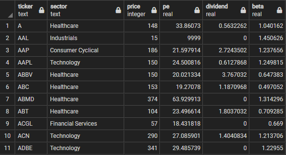
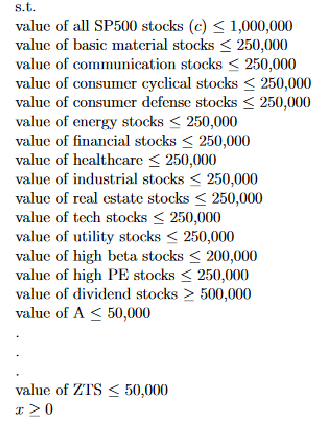

# Portfolio-Optimizer-LP

Optimize portfolio subject to self-defined constraints by implementing linear programming/simplex method.  

1. Gathers relevant asset data. 
2. Generates LP problem with data subject to user's self-determined constraints.
3. Solves LP problem to get optimal objective (in this case, a list of stocks or assets that gets the best objective subject to constraints).  

Example Data: List of SP500 stocks with various data types   
   

Example Constraints   
   

Example optimal list of stocks subject to constraints (with objective of maximizing amount of capital invested)   

